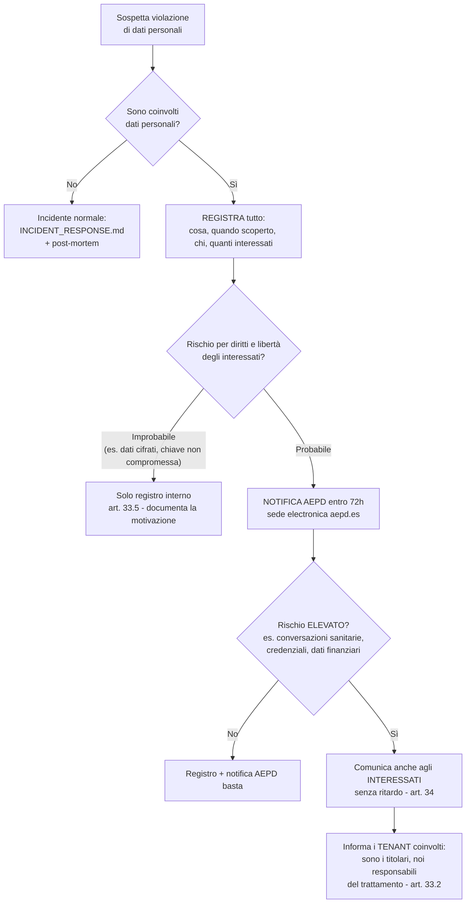

# Notifica violazioni dati (GDPR / AEPD)

*Versione 1.0 — luglio 2026. Owner: Steward (tecnica) + Sofía (comunicazioni).
Autorità competente: AEPD (Spagna) — sede espansione principale; per tenant
italiani coordinarsi anche col Garante.*

## Albero decisionale (entro 72 ore dalla scoperta)

## Ruoli GDPR — chi notifica chi

- **BALI Flow è responsabile del trattamento** (processor) per i dati dei clienti
  finali dei ristoranti: se la violazione tocca quei dati, il nostro obbligo
  primario è avvisare **senza ritardo il tenant** (titolare), che notifica AEPD.
- **BALI Flow è titolare** per i propri dati (account staff dei tenant, dati di
  fatturazione dei tenant): lì notifichiamo noi direttamente AEPD entro 72h.

## Contenuto minimo della notifica (art. 33.3)

1. Natura della violazione, categorie e numero approssimativo di interessati e
   record.
2. Contatto: `security@baliflowagency.com`.
3. Probabili conseguenze.
4. Misure adottate o proposte (contenimento, rotazione chiavi, ripristino).

## Registro violazioni

Ogni evento (anche quelli NON notificati) va registrato in
`docs/security/archive/breach-YYYY-MM-DD.md` con la valutazione del rischio e
la decisione presa. È l'evidenza di accountability richiesta dall'art. 33.5.
