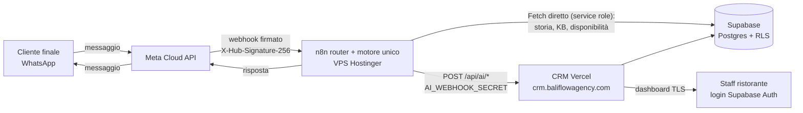
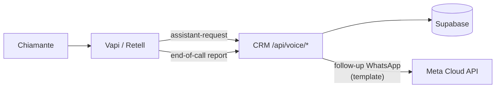
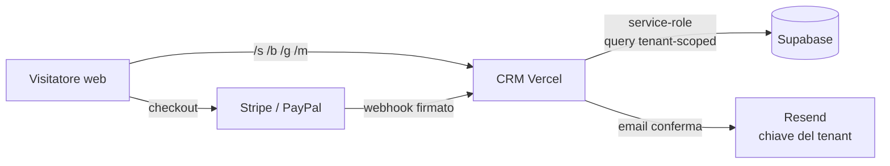

# Flusso dei dati

*Versione 1.0 — luglio 2026. Owner: Steward. Aggiornare se cambia
l'architettura (nuovo canale, nuovo provider).*

## Canale WhatsApp (principale)

## Canale voce

## Pagine pubbliche e pagamenti

## Dove vivono i dati personali

| Dato | Dove | Protezione |
|---|---|---|
| Numeri di telefono, nomi, conversazioni | Supabase (`guests`, `conversations`) | RLS per-tenant, TLS, retention/DSAR |
| Credenziali POS/email/pagamento dei tenant | Supabase, cifrate | AES-256-GCM (`POS_CRED_ENC_KEY`) |
| Segreti di piattaforma per-tenant | `tenants.secrets` (JSONB) | Solo service-role — rischio accettato n.1 |
| Dati pagamento carte | Solo presso Stripe/PayPal | mai sul nostro DB |
| Registri fiscali | `fiscal_records` append-only | catena huella SHA-256 |
| Audit e login | `audit_events`, `login_events` | service-role only |
